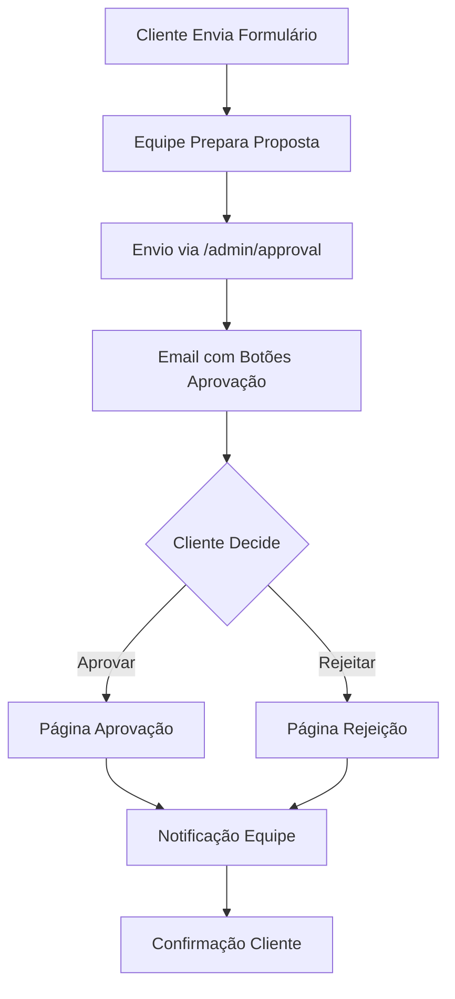

# 🎮 Sistema de Aprovação por Email - PlayCode Agency

Sistema completo de aprovação de orçamentos via email com segurança avançada, templates profissionais e interface gaming.

## 📋 Funcionalidades

### ✅ **Implementado**

- **🔐 Segurança Avançada**: Tokens HMAC SHA-256 com expiração
- **📧 Templates Profissionais**: Design gaming cyberpunk responsivo
- **🎨 Interface Completa**: Página de aprovação com UX otimizada
- **🔄 Workflow Automático**: Notificações para equipe e cliente
- **📊 Monitoramento**: Logs de segurança e tracking de ações
- **⚡ Performance**: Sistema de cache e validação otimizada

### 🚀 **Workflow do Sistema**



## 🛠️ Configuração

### 1. **Instalar Dependências**

```bash
npm install nodemailer @types/nodemailer
```

### 2. **Configurar Variáveis de Ambiente**

Copie `.env.example` para `.env.local`:

```bash
cp .env.example .env.local
```

Configure as variáveis:

```env
# Email Configuration
SMTP_HOST=smtp.gmail.com
SMTP_USER=your-email@gmail.com
SMTP_PASS=your-app-password
SMTP_FROM=noreply@playcode.agency

# Security
TOKEN_SECRET_KEY=your-256-bit-secret-key-here
ADMIN_APPROVAL_TOKEN=your-secure-admin-token-here

# App Configuration
NEXT_PUBLIC_APP_URL=https://playcode.agency
```

### 3. **Configurar SMTP (Hostinger)**

1. Use as credenciais do seu email Hostinger
2. Configure a senha da conta de email no `SMTP_PASS`
3. O SSL é obrigatório na porta 465

## 📡 **APIs Disponíveis**

### **POST /api/approval/send**

Envia proposta de orçamento para cliente.

**Headers:**
```json
{
  "Content-Type": "application/json"
}
```

**Body:**
```json
{
  "customerName": "João Silva",
  "customerEmail": "joao@empresa.com",
  "projectType": "Website Corporativo",
  "projectDescription": "Desenvolvimento de site institucional...",
  "budgetRange": "R$ 5.000 - R$ 10.000",
  "estimatedValue": 7500,
  "timeline": "4-6 semanas",
  "services": [
    "Design Responsivo",
    "SEO Otimizado",
    "CMS Integrado"
  ],
  "powerUps": ["Analytics", "WhatsApp"],
  "adminToken": "your-admin-token"
}
```

**Response:**
```json
{
  "success": true,
  "message": "Proposta enviada com sucesso!",
  "data": {
    "customerId": "abc123def456",
    "customerEmail": "joao@empresa.com",
    "projectType": "Website Corporativo",
    "estimatedValue": 7500,
    "tokenId": "12345678",
    "sentAt": "2025-01-20T10:30:00.000Z"
  }
}
```

### **GET /api/approval/[token]**

Valida token e retorna dados da proposta.

**Response:**
```json
{
  "success": true,
  "data": {
    "tokenData": {
      "customerId": "abc123def456",
      "email": "joao@empresa.com",
      "projectType": "Website Corporativo",
      "createdAt": 1640995200000,
      "expiresAt": 1641600000000
    },
    "approvalData": {
      "customerName": "João Silva",
      "projectType": "Website Corporativo",
      "budgetRange": "R$ 5.000 - R$ 10.000",
      "estimatedValue": 7500,
      "timeline": "4-6 semanas",
      "services": ["Design Responsivo", "SEO Otimizado"],
      "powerUps": ["Analytics", "WhatsApp"]
    },
    "expiresAt": "2025-01-27T10:30:00.000Z"
  }
}
```

### **POST /api/approval/[token]**

Processa decisão do cliente (aprovar/rejeitar).

**Body:**
```json
{
  "action": "approve", // ou "reject"
  "feedback": "Proposta aprovada! Vamos começar o projeto."
}
```

**Response:**
```json
{
  "success": true,
  "message": "🎉 Proposta aprovada com sucesso!",
  "data": {
    "action": "approve",
    "customerEmail": "joao@empresa.com",
    "projectType": "Website Corporativo",
    "processedAt": "2025-01-20T11:00:00.000Z"
  }
}
```

## 🎨 **Páginas Disponíveis**

### **`/aprovacao/[token]`**

Página de aprovação/rejeição para o cliente:

- ✅ **Design Gaming**: Interface cyberpunk responsiva
- ⏰ **Contador de Tempo**: Mostra tempo restante
- 💰 **Detalhes Claros**: Valor, prazo, serviços
- 🔒 **Segura**: Validação de token automática
- 📱 **Responsiva**: Otimizada para mobile

### **Estados da Página:**

1. **Loading**: Carregando dados da proposta
2. **Error**: Token inválido ou expirado
3. **Proposal**: Exibindo proposta para decisão
4. **Success**: Decisão processada com sucesso

## 🔒 **Segurança**

### **Tokens Seguros**

- **HMAC SHA-256**: Assinatura digital inviolável
- **Dados Embarcados**: Informações no próprio token
- **Expiração**: 7 dias configurável
- **Uso Único**: Token invalidado após uso

### **Estrutura do Token**

```
token = base64url(dados) + "." + base64url(assinatura)
```

**Dados embarcados:**
```json
{
  "customerId": "abc123def456",
  "email": "cliente@empresa.com",
  "projectType": "Website",
  "createdAt": 1640995200000,
  "expiresAt": 1641600000000
}
```

### **Logs de Segurança**

Todos os eventos são logados:

- `approval_send_attempt` - Tentativa de envio
- `approval_page_access` - Acesso à página
- `approval_decision_made` - Decisão tomada
- `invalid_approval_token` - Token inválido
- `email_send_failure` - Falha no envio

## 📧 **Templates de Email**

### **Email de Proposta**

- **Header**: Gradient cyberpunk com logo
- **Seções**: Valor, serviços, power-ups, timeline
- **Botões**: "Aprovar" e "Rejeitar" com links únicos
- **Footer**: Informações de contato e código da proposta

### **Email de Notificação (Equipe)**

- **Status**: Aprovação ou rejeição destacada
- **Dados**: Cliente, projeto, valor
- **Próximos Passos**: Lista de ações para a equipe

### **Email de Confirmação (Cliente)**

- **Aprovação**: Confirmação com próximos passos
- **Rejeição**: Agradecimento e disponibilidade futura

## 🚀 **Como Usar**

### **Para a Equipe:**

1. Cliente envia formulário de contato
2. Equipe acessa sistema interno
3. Prepara proposta com todos os dados
4. Envia via API com token de admin
5. Cliente recebe email com botões
6. Equipe recebe notificação da decisão

### **Para o Cliente:**

1. Recebe email com proposta
2. Clica em "Aprovar" ou "Rejeitar"
3. Vê página com todos os detalhes
4. Confirma decisão (opcional: deixa feedback)
5. Recebe confirmação por email

## 🔧 **Desenvolvimento**

### **Estrutura de Arquivos**

```
src/
├── app/
│   ├── api/approval/
│   │   ├── send/route.ts
│   │   └── [token]/route.ts
│   └── aprovacao/[token]/page.tsx
├── lib/
│   ├── services/email-approval.ts
│   └── security/token-manager.ts
└── components/
    └── admin/ApprovalSender.tsx
```

### **Comandos Úteis**

```bash
# Desenvolvimento
npm run dev

# Build
npm run build

# Testes
npm run test
```

## 📊 **Monitoramento**

### **Métricas Importantes**

- **Taxa de Aprovação**: % de propostas aprovadas
- **Tempo de Resposta**: Tempo médio para decisão
- **Tokens Expirados**: % de tokens não utilizados
- **Erros de Email**: Falhas no envio

### **Logs Úteis**

```bash
# Ver logs de aprovação
grep "approval_" logs/application.log

# Ver emails enviados
grep "📧 Email" logs/application.log

# Ver decisões processadas
grep "✅ Decisão processada" logs/application.log
```

## 🐛 **Troubleshooting**

### **Problemas Comuns**

**1. Emails não enviados**
```bash
# Verificar configuração SMTP
echo $SMTP_HOST $SMTP_USER

# Testar conexão SMTP
telnet smtp.gmail.com 587
```

**2. Token inválido**
```bash
# Verificar chave secreta
echo $TOKEN_SECRET_KEY

# Verificar expiração
node -e "console.log(new Date(Date.now() + 7*24*60*60*1000))"
```

**3. Página não carrega**
```bash
# Verificar URL
echo $NEXT_PUBLIC_APP_URL

# Verificar rota
curl http://localhost:3000/api/approval/test-token
```

## 📋 **TODO / Melhorias Futuras**

- [ ] **Banco de Dados**: Migrar de Map para PostgreSQL/MongoDB
- [ ] **Dashboard Admin**: Interface para gerenciar propostas
- [ ] **Templates Customizáveis**: Editor de templates de email
- [ ] **Integrações**: Slack, Discord, WhatsApp notifications
- [ ] **Analytics**: Dashboard com métricas de aprovação
- [ ] **Multi-idioma**: Suporte a múltiplos idiomas
- [ ] **Assinatura Digital**: Assinatura eletrônica na aprovação
- [ ] **Workflow Avançado**: Múltiplos níveis de aprovação

## 🤝 **Suporte**

Para suporte técnico ou dúvidas:

- **Email**: dev@playcode.agency
- **Discord**: PlayCode Community
- **GitHub**: Issues e Pull Requests

---

**PlayCode Agency** - Transformando visões em realidade digital 🎮✨